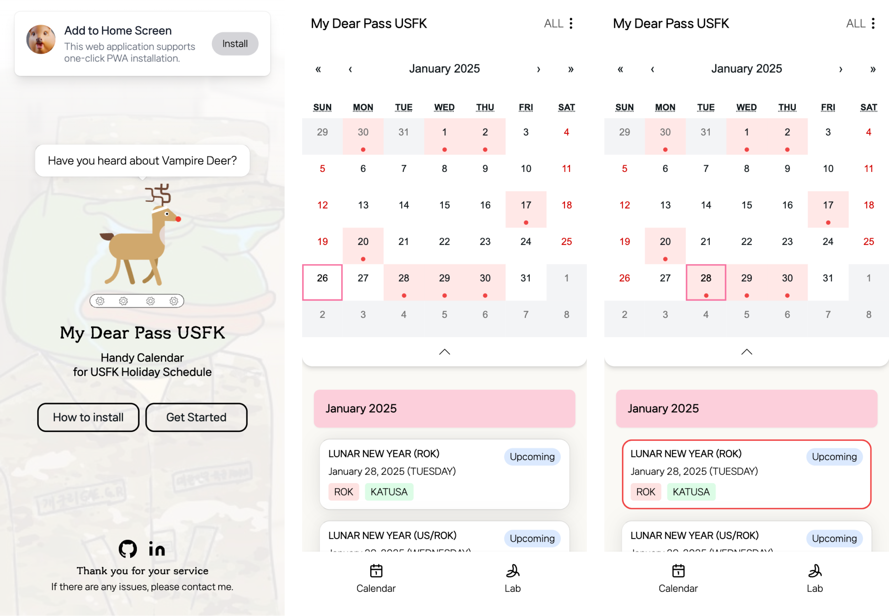

# My Dear Pass USFK

  <!--
  <strong>🏆 2023 제주특별자치도 도지사상 수상 작품 🏆</strong>
  -->
   
  <strong>Handy Calendar Web Service for the <a href="https://8tharmy.korea.army.mil/site/index.asp)">US Eighth Army</a> USFK Holiday Schedule Table</strong>
   
   
  
   
    
  

 
  

  
  <strong>Let's try the product from below badge link<strong>
   
   
  

 
 

# PWA Installation

    

        🍎 If you are iOS user :)
    

1. **Open the Safari web browser** on your iOS device.
2. **Visit the website** of the PWA you wish to install.
3. Once the website loads, **tap the Share button** at the bottom center of the screen. It resembles a square with an arrow pointing upwards.
4. In the Share menu, **locate the “Add to Home Screen” option. Tap on it.**
5. You will be prompted to customize the name of the app and, in some cases, the app’s icon.
6. **Tap the “Add” button in the screen’s upper-right corner.**
7. The PWA will now be added to your home screen as an app icon.
8. You can launch the PWA by tapping its icon like any other app on your device.

    
    
    🤖 If you are Android user :)
    

1. **Open the Google Chrome browser** on your Android device.
2. **Visit the website** of the PWA you want to install.
3. Once the website loads, **tap the menu button** (usually represented by three vertical dots) located in the top right corner of the browser.
4. In the menu, **scroll down and look for the “Add to Home screen” option. Tap on it.**
5. A pop-up window will appear, displaying the app’s name and icon. You can customize the name if desired.
6. **Tap the “Add” button or “Add to Home screen” to confirm.**
7. The PWA will now be installed on your device and added to your home screen as an app icon.

 
 

# How to Use

1. Set up your category

2. Extend / Hide Calendar

3. Scroll down holiday list
